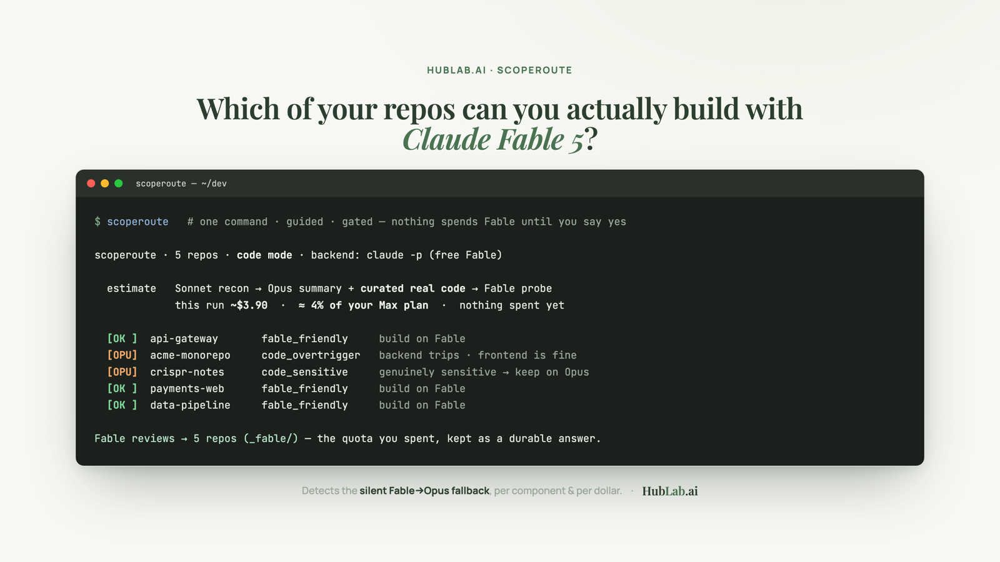

# scoperoute

[](https://github.com/botable-dev/scoperoute)
[](https://github.com/botable-dev/scoperoute/stargazers)
[](LICENSE)
[](https://hublab.ai)

> **⏳ Claude Fable 5 is free on Claude Code only until July 7 — after that, API pricing ($10 / $50 per M).**
> Find out where your free window actually lands *before* you burn it.

**Which of your repos can you actually build with Claude Fable 5 — and is Fable even answering you?**



Fable 5's safety classifier reads the *context* of your request — your `CLAUDE.md`, the file tree, the
**real code** — and quietly **falls back to Opus** on repos it doesn't like. You can spend your free week
on the best model and never actually get it. scoperoute probes Fable **per component** (on your real code,
not a description), tells you exactly where it cooperates, and prices the run — tokens, dollars, and a slice
of your Claude plan — before you spend anything.

And the triage pays for itself: every probe leaves a **free Fable architecture review** in each repo's
`_fable/` — the quota you spend becomes a second opinion on your design.

It isn't another code reviewer — Claude Code already ships `/code-review` and `/security-review` for finding
bugs; scoperoute answers the question that comes *before* you build: which model each repo should run on,
and what it costs.

## Install & run in 60 seconds

One script sets up **both** the terminal command and the Claude Code skill — stdlib only, no API key:

```bash
git clone https://github.com/botable-dev/scoperoute && cd scoperoute && ./install.sh
scoperoute            # guided, gated wizard — nothing spends Fable until you say yes
```


Prefer the marketplace plugin?

```bash
claude plugin marketplace add botable-dev/scoperoute
claude plugin install scoperoute@hublab       # then /reload-plugins → /scoperoute:scoperoute
```

`install.sh` gives you a bare **`/scoperoute`** in Claude Code (a personal skill) and a **`scoperoute`**
terminal command; the marketplace plugin gives you **`/scoperoute:scoperoute`**.

### …or have Claude Code install it for you

Paste to Claude Code:

> Clone github.com/botable-dev/scoperoute, run its `./install.sh`, then run `scoperoute --root ~/dev --estimate`
> and show me the cost. If `/scoperoute` isn't active yet, tell me to run `/reload-plugins` or restart.

…or, to jump straight to a subscription-aware estimate:

> install `github.com/botable-dev/scoperoute`, evaluate the tokens/$ per part, ask my Claude plan
> (Pro/Max/Team) to compute my spend in $ and % of the plan, and tell me what to run first.

## What you get

**A cost estimate before you spend anything** — tokens and dollars *per pipeline part*, plus your plan:

```
By stage (tokens / $ per part):
  recon     sonnet-5    calls=16  in=1,830,000 out=6,200   $ 3.72
  summary   opus-4-8    calls=16  in=  40,000  out=22,000  $ 0.75
  probe     fable-5     calls=48  in=  57,600  out=24,000  $ 1.78
  controls  opus+sonnet calls=?   …                        (only components that trip)

Subscription
  detected plan: Claude Max  (via CodexBar)
  this run: ~$6.25–$9.10 notional  =  6.3–9.1% of your monthly plan
  run these first (cheapest → dearest):
    $0.15  vpn      $0.33  reels      $0.75  kardan-repair …
```

**A per-component verdict** — so you keep Fable where it works and route the rest to Opus:

```
PROJECT            VERDICT             RECOMMENDATION
api-gateway        fable_friendly      Build on Fable — every component cooperates.
acme-monorepo      code_overtrigger    Fable balks on: backend (sensitive). Use Opus there; frontend is fine.
crispr-notes       code_sensitive      Genuinely sensitive. Opus, with care.
```

## How it works

The default mode is **`code` — no trimming**. Instead of truncating your code to a byte budget (an
anti-pattern that judges a mutilated fragment), it distills, then probes on the *real* implementation:

1. **Recon** — Sonnet 5 reads the project's files *itself* and inventories its components.
2. **Summary** — Opus 4.8 writes a clean architecture summary per component.
3. **Curate** — Opus 4.8 selects the **real code** that carries the most signal — whole functions, not a
   byte slice — because a guardrail can wave through a benign-sounding *description* yet fire on the actual
   implementation (a library, a syscall, a pattern). This is what Fable sees when you build.
4. **Probe** — Fable 5 is asked to *improve* each component (summary **+ real code**); a refusal (or a
   silent Opus fallback) means it won't cooperate there.
5. **Rollup** — per-component verdicts become a project verdict, naming what to keep off Fable.

If Fable refuses, the same payload runs through **Opus 4.8 + Sonnet 5** controls: both answer → Fable
over-triggered (benign, use Opus); every model refuses → genuinely sensitive. `--repeat N` turns a
borderline coin-flip into a trip fraction. Prefer a cheaper pass? `--probe arch` is prose-only (no code);
`--probe summary` is the fast legacy probe.

**Your spent quota becomes an artifact.** After a run, scoperoute writes each probed repo a
`_fable/fable-architecture-review.md` — Fable's own review of each component, recovered from the run's
transcripts. The triage pays for itself in a preliminary review. (Opt out with `--no-fable-docs`.)

Details: [`interpreting-results.md`](skills/scoperoute/references/interpreting-results.md) ·
[`how-it-works.md`](skills/scoperoute/references/how-it-works.md).

## Cost, transparently

Because `code` mode reads whole codebases, always estimate first:

```bash
scoperoute --root ~/dev --repeat 3 --estimate
```

It prices the run per project *and* per part (Sonnet → Opus → Fable), and — via
[CodexBar](https://github.com/konon4/CodexBar) — reads your real Claude tier, current window usage, and
spend to date, so you see the run as a **% of your plan** and which projects to run first. No CodexBar or
not logged in? It asks your tier (Pro/Max/Team) and uses a transparent price table.

## Privacy

Metadata only. Reports carry verdicts, recommendations, and per-component flags — never your code.
Refusal categories stay in a local, gitignored file; the shareable CSV never contains them, and a
refusal's explanation URL is never read or emitted. Identities from CodexBar are redacted.

## Fine print

- **Fable needs ≥30-day data retention** — under zero/under-30-day retention every Fable request 400s.
- It only detects and routes. For a genuinely sensitive project the answer is Opus — scoperoute never
  coaxes Fable.
- Dollar figures are *notional* (API-equivalent); on a subscription you spend quota, not dollars — the
  numbers let you compare runs and size them against your plan.

## Credits

Real tier/usage/spend comes from [CodexBar](https://github.com/konon4/CodexBar) (a fork of
[steipete/CodexBar](https://github.com/steipete/CodexBar), MIT). Session-transcript reading is grounded in
[claude-session-sync](https://github.com/konon4/claude-session-sync).

---

Built by **[HubLab.ai](https://hublab.ai)** — a boutique AI & data development agency · Astana. MIT.
